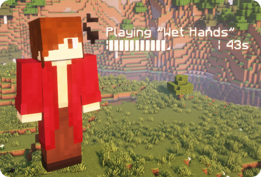

# Tanner Limes's[^whoIsTannerLimes] Music Player for Figura

[Figura](https://github.com/Kingdom-of-The-Moon/FiguraRewriteRewrite) is a Minecraft mod that lets you completely customize your avatar with custom models and Lua scripts.

This repo is a Figura avatar lets you play music in game for you and others to hear.

⚠️ Heads up: This avatar requires [LUtils](https://github.com/lexize/lutils) in order to work. See the installation instructions below for more details.

# Instalization and usage
Lol, not quite yet. I need to test if you can put audio into a readme file.

[^whoIsTannerLimes]: Yes, Tanner Limes and Charlie Mikels are the same person. Don't worry about it.
