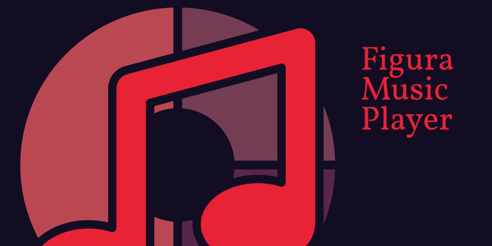

# Tanner Limes' Figura Music Player

[Figura](https://github.com/FiguraMC/Figura) is a Minecraft mod that lets you completely customize your avatar with custom models, sounds, animations, and Lua scripts.

This repo is a Figura avatar that lets you play MIDI music in Minecraft for you and others to hear. It's inspired by [Starbound](https://store.steampowered.com/app/211820/Starbound/)'s instrument items.

[Tanner_Limes_configures_and_plays_Bad_Apple__half_song_720_30fps.webm](https://github.com/user-attachments/assets/24ba8306-e10a-4143-b75f-c45c9df47924)

(↑ If there's no sound, be sure the video player is not muted. ↑)

## Installation

This version of this script was built for Figura 0.1.5b. Check the Github releases for versions compatible with older versions of Figura.

This repo is a complete, ready to go, Figura avatar, but the good stuff is all in the `scripts/music_player` directory. You can download this entire repo and just use it as your avatar, or extract the scripts and merge them with your existing avatar.

Download this avatar from [the releases page](https://github.com/charliemikels/figura-music-player/releases) or by using the green `code` button at the top of this repo. Then you can drop it into your Avatars folder. (You can actually drag-and-drop the entire zip file into the Figura Wardrobe screen in-game and it should work.)

### Existing avatars

If you're looking to add the music player to an existing avatar, then you'll only need the `scripts/music_player` folder. Copy it into your existing avatar. Then take a look at `action_wheel.lua` to see how you can integrate it into your action wheel.

### Getting music

Once It's downloaded, you'll need to populate your library with music.

After equipping the avatar for the first time, you should see a new `[Figura root dir]/data/TL_Songbook` directory.

If you don't know where the Figura root directory is, you can get to it from within Minecraft.

<ol>
    <li>Open Minecraft and load into a world.</li>
    <li>In the pause menu, open the Figura menu.</li>
    <li>Click the folder icon in the upper left. This should bring up the `Avatars` folder in your file browser.</li>
    <li>Navigate up one folder. This should be Figura's root folder. You should be able to see your <code>avatars</code> folder and the <code>data</code> here.</li>
</ol>

You can then place any `.midi` or `.mid` file in that folder, then reload the avatar. your songs should be available to play.

Your file structure should look something like this.

<pre>
[[ Figura root ]]
├ avatars
│ └ Music Player   ← This folder can have any name
│   ├ avatar.json
│   ├ scripts
│   │ ├ music_player
│   │ │ ├ file_processors…
│   │ │ ├ instruments…
│   │ │ ├ core.lua
│   │ │ ├ file_processors.lua
│   │ │ ├ ui.lua
│   │ │ └ …
│   │ └ Action Wheel.lua
│   └ …
├ data
│ ├ TL_Songbook
│ │ ├ optional_sub_dir
│ │ │ └ organized_song.midi
│ │ ├ song2.midi
│ │ └ song*.midi
│ └ …
└ …
</pre>

## Default In-Game Usage

The controls for this avatar are in their own Action Wheel page. Open the Action Wheel and click the jukebox to access the song player controls. You should new see 3 buttons:

### Top right: Back

Left click sends you back to the previous Action Wheel page

### Left: Song selector

While hovering over the song selector action, use your scroll wheel and left click buttons to select and play songs.

Songs need to be prepared before they can be played. Left click to process a song, and then click again once it's done to play it.

| mark      | meaning                                  |
| --------- | ---------------------------------------- |
| (no mark) | song is unprocessed                      |
| ⏳        | Song is currently being processed        |
| ✓         | Song is processed and ready to be played |
| ♬         | Song is playing                          |
| 🚫        | There was an error during processing     |

To stop playback, click the playing song, or click on any processed song. The UI will prevent you from playing two songs at once.

There's some info above and below the song selection list to help you understand what's going on.

You can also hold down your Sprint key to scroll the list faster (rebindable in the Figura settings menu).

## Bottom right: Configure

Songs that are processed but are not playing can be configured with this button.

This opens up a new menu menu that lets you pick what instruments you want to use to play your song

### Right: Save / Cancel

Both of these will take you back to the main Music Player action wheel, but the save button will apply and remember your configuration, but cancel will discard your changes.

### Bottom left: Track selector

Lets you pick what track your editing. No need to click, moving the arrow is enough to select it.

The first row of each track says the name of the track, or the recommended instrument to use for the track. These are provided by your midi file.

The row below it shows your currently selected instrument.

### Top left: Instrument picker

This is a list of instruments available to your script and it lets you pick one for the track you selected in the Track Selector (see above).

Use the scroll wheel and left click to select an instrument.

Some instruments have special features marked with extra icons.

| mark | meaning                                                                  |
| ---- | ------------------------------------------------------------------------ |
| 🥁   | Percussion instrument, not intended for normal playback.                 |
| 🗘    | Instrument can hold/sustain a note.                                      |
| 🛝   | Instrument supports pitch bending. A somewhat rare effect in midi files. |

If an instrument name is grayed out, then it is currently not available. You can still choose it, but it might fall back to a default instrument during playback until it becomes available.

#### ChloeSpacedOut instruments

This script includes extra wrappers that let it use [ChloeSpacedOut](https://github.com/ChloeSpacedOut)'s [Figura Piano 2.0](https://github.com/ChloeSpacedOut/figura-piano-2.0) as an instrument (both in piano and drumkit mode).

In order to use them, you will need to stand near one, and you and your listeners will need to follow the [Basic Usage instructions](https://github.com/ChloeSpacedOut/figura-piano-2.0#basic-usage) so that they can be heard by everyone properly.

<!-- TODO: Video of the piano and drumkit in action. _Bad Apple_ maybe? -->

## Modularity

One of the major goals of this rewrite was to make this project much more usable as a library for other avatars. The project is now made up of several semi-modular scripts, and has [LuaLS](https://github.com/LuaLS/lua-language-server) type comments all over the place.

Take a look at the `scripts/README.md` file, to get an overview of the project. Each script should also have a comment at the top describing what it does, and all its returns should be at the bottom.

Note that if you use LuaLS, removing scripts might cause it to throw type errors, but Lua at runtime (probably) won't care.

## FAQ

### How can I get the piano?

You'll want to follow the [piano's basic usage instructions](https://github.com/ChloeSpacedOut/figura-piano-2.0#basic-usage). If you can't use commands, but can get player heads, you can instead

1. Equip the Piano avatar to an account you control. (It may be possible to merge it with this Music Playing script and use just one avatar)
2. Get your player head
3. Get the UUID of the account with the piano equipped. (You can do that from within Figura by going to permissions, right click the avatar, copy UUID)
4. Add the UUID to the lists in `scripts/music_player/instruments/chloespacedout_instruments/piano.lua` and `…/drumkit.lua`.
5. Reload the music player avatar.

But if you're going through this much effort, you might as well check out [ChloeSpacedOut's Figura Midi Player](https://github.com/ChloeSpacedOut/figura-midi-player). It's basicaly the same kind of script as mine, but has more dirrect access to the Piano's extensive instrument library.

### Who's Charlie? I thought you were Tanner? (and vice versa)

Tanner_Limes is my Minecraft username. Hi Discord people!

### Does it work on Default permissions?

Yes. The host needs to be at MAX in order to use the File processors, but **most songs are playable at LOW permissions**. The limiting factor is how many instruments a song is using, and how complex they are.

Here's Rush E, in multiplayer, where the viewer has set this script to LOW permissions.

https://github.com/user-attachments/assets/edd2eb7a-d5ba-4e06-8544-566fa3d33720

(Appologies for the 240p demo video. Github's 10MB limit is pretty tight.)

Some caveats about this demo

<ul>
    <li>It takes an impracticaly long time to buffer. (~11 minutes at current settings)</li>
    <li>To actualy hear anything meaningful, the viewer would need to enable the Unlimited Sounds advanced setting. However it eventualy runs into Minecraft's internal 247 sound limit. </li>
    <li>Unfortunantly the default Triangle Sine instrument hits a resource limit arround the 113s mark. However, the Noteblock instruments and using ChloeSpacedOut's piano are able to complete the song.</li>
</ul>

## Changes in v5

Version 5 comes with significant changes

- Native MIDI file support.
  - ABC support has been deprecated. However, you should be able to convert most ABC files back to MIDI without any loss.
- Songs can now be included with avatar upload.
- fewer instructions during playback. Most songs play on Low permissions.
  - (Although, Low's restrictive number of sounds really limits possible complexity)
- A script can play multiple songs at once.
- Songs can have multiple configurable instruments.
- Supports [Figura Piano 2.0](https://github.com/ChloeSpacedOut/figura-piano-2.0) (both in piano and drumkit mode) by [ChloeSpacedOut](https://github.com/ChloeSpacedOut)
  - Does not support the older piano.
- Volume and Pitch effects.
- Rewritten from scratch to make the script more modular. Some scripts may be removed if you don't need certain features.
