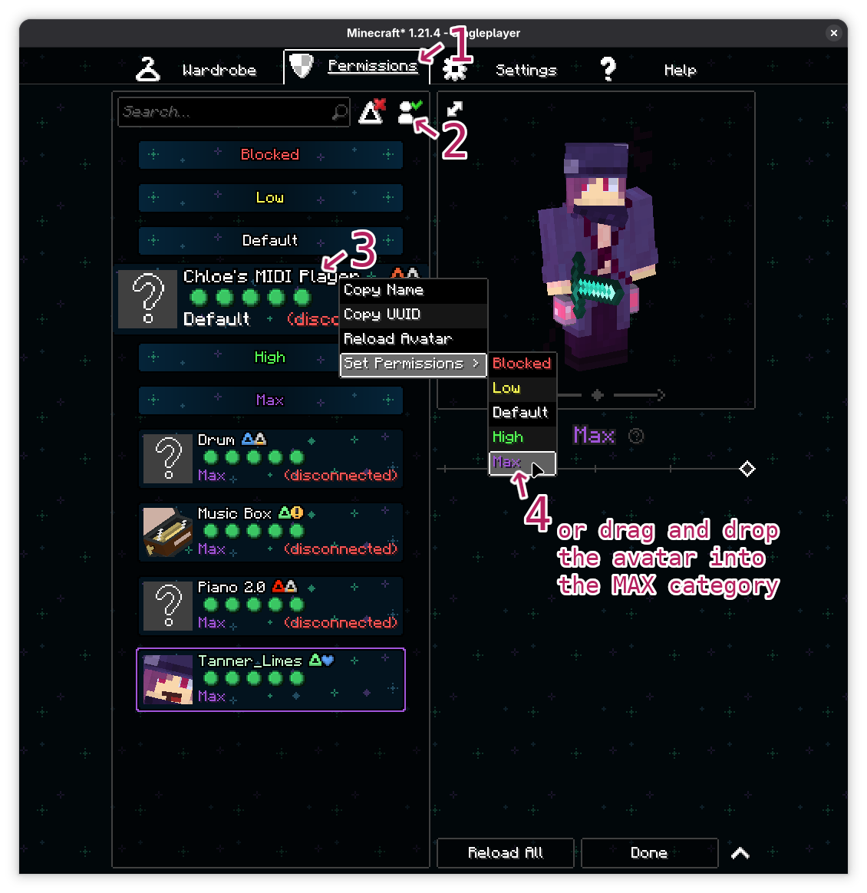

The Instruments in this Folder are all powered by [ChloeSpacedOut](https://github.com/ChloeSpacedOut)'s [Figura Midi Cloud](https://github.com/ChloeSpacedOut/figura-midi-player) avatar. But the Midi Cloud only works if you and your listeners set the Midi Cloud Avatar to MAX permissions. Without it, you and your listeners will here a fallback instrument instead of the one you selected.

To make sure everyone hears these instruments correctly, you and your followers will need to follow Chloe's official setup instructions [here](https://github.com/ChloeSpacedOut/figura-midi-player), but here's a TLDR:

## Setup TLDR

After you equip the Music Player avatar, you **and your listeners** will need to

1. Go into Figura → Permissions.
2. Click "Show Disconnected Avatars" 
3. Look for (scroll, don't search) for the "Chloe's MIDI Player" avatar.
4. Set it to MAX permissions.

I have yet to find a good way to quickly and reliably teach your listeners about these steps and also not annoy them every time the the host plays a song that uses this instrument. As such, I'm making it the host's responsibility to teach their own listeners. This might come back to haunt me, but if you're here because you got a "Please see the README" message in your chat, you can suppress the warning by running "/figura run TL_cloud_midi_instrument_suppress_warning()". Yes I've intentionally tried to hide it. Thank you for reading the README. 

### Piano and drumkit

The "Piano" and "Drumkit" instruments behave slightly differentially. While they themselves rely on the Midi Cloud, you and your listeners will need to set `Piano 2.0`'s permissions to MAX in order to hear these instruments. Like Chloe MIDI Player, it is also a disconnected avatar.

For help spawning a piano and other usage notes, please see [Figura Piano 2.0's Github page](https://github.com/ChloeSpacedOut/figura-piano-2.0).
